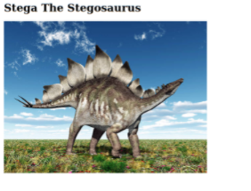
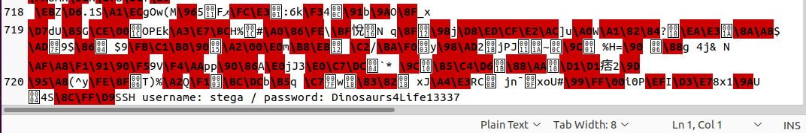

    	Stegosaurus

​		18th May 2021

​		Machine Author(s): Andrew Campi (Campister)

### Description:

This machine provides an introduction to steganography. Steganography is the technique of hiding secret data within an ordinary, non-secret, file or message in order to avoid detection. Similar to writing a letter in invisible ink to hide a message, steganographic images have hidden text encoded into the image that is only noticeable to those who are looking for it.

### Difficulty:

`easy`

### Flags:

User: `873d55dfff433c90b42dacd4b0aa9ded`

Root: `6aa9d2e3e276faf9e7abbba9aa53fd39`

# Enumeration
`$ nmap -sV <target_ip_address>`

Nmap reveals ssh running on port 22 and an apache web server running on port 80. In a web browser, visiting the target’s ip address displays a very basic web page. It’s only contents are a title which says “Stega the Stegosaurus” and a picture of a stegosaurus.

# Foothold
From here, the hint of “stega” and the webpage only containing an image should make the next conclusion obvious. The image is steganographic, meaning that it has a hidden message encoded.

Download the image to your desktop by dragging it from the webpage and placing it on your desktop. To view the steganographic message, we can convert the jpg to a txt file by renaming the image to be Stega.txt instead of Stega.jpg. Alternatively, you could simply open the unconverted jpg file with a text editor such as Vim to view the hidden message at the end of the file.

The hidden message is at the bottom of the file, towards the last line. It says “SSH user: stega / password: Dinosaurs4Life13337”. We can use this information to login to the target’s machine through SSH.

`$ ssh stega@<target_ip_address>`

`$ password: Dinosaurs4Life13337`

We are in! The user flag can be located on Stega’s desktop.

`$ cd Desktop`

`$ cat user.txt`

# Privilege Escalation
To access the root flag, we need root privileges. Use the following command to gain root privileges, then use the following commands to access the root flag.

`$ sudo -i`

`$ [sudo] password for stega: Dinosaurs4Life13337`

`$ cat root.txt`
